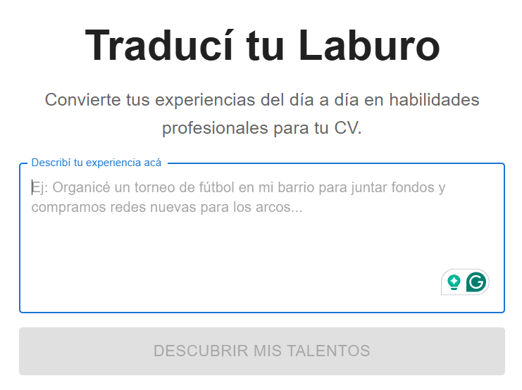

# Traductor de Experiencia Profesional


Una aplicación web que traduce descripciones de experiencias laborales cotidianas en frases profesionales y habilidades clave para tu currículum (CV). Ideal para potenciar tu perfil sin importar tu experiencia previa.

<br/>

<p align="center">
  
</p>

---

## 📋 Tabla de Contenidos

1.  [Acerca del Proyecto](#-acerca-del-proyecto)
2.  [Características Principales](#-características-principales)
3.  [Tecnologías Utilizadas](#-tecnologías-utilizadas)
4.  [Cómo Empezar](#-cómo-empezar)
    * [Prerrequisitos](#prerrequisitos)
    * [Instalación](#instalación)
5.  [Uso](#-uso)
6.  [Roadmap](#-roadmap)
7.  [Cómo Contribuir](#-cómo-contribuir)
8.  [Licencia](#-licencia)
9.  [Contacto](#-contacto)

---

## 🎯 Acerca del Proyecto

Muchas personas con gran potencial subestiman su experiencia laboral, especialmente si proviene de trabajos no tradicionales, informales o en sus primeras etapas profesionales. Tareas valiosas a menudo se describen de forma demasiado simple en un currículum, perdiendo la oportunidad de destacar.

Este proyecto nació para resolver ese problema: es una herramienta intuitiva que sirve como "traductor" entre el lenguaje cotidiano y el lenguaje corporativo. Ayuda a los usuarios a identificar y articular las habilidades transferibles y los logros ocultos en sus roles, permitiéndoles presentar un perfil profesional mucho más sólido y competitivo.

---

## ✨ Características Principales

* **Traducción Inteligente:** Convierte descripciones simples en frases de alto impacto.
* **Identificación de Habilidades:** Sugiere competencias clave basadas en la tarea descrita.
* **Interfaz Limpia y Sencilla:** Diseñada para ser fácil de usar, sin distracciones.
* **Resultados Listos para Copiar:** Genera texto optimizado para ser pegado directamente en tu CV o perfil de LinkedIn.

---

## 🛠️ Tecnologías Utilizadas

Este proyecto fue construido utilizando las siguientes tecnologías:

* **Frontend:** [Ej: React.js]
* **Backend:** [Ej: Node.js con Express]
* **Base de Datos:** [Ej: MongoDB]
* **Despliegue (Hosting):** [Ej: Vercel / Netlify / AWS]

---

## 🚀 Cómo Empezar

Para obtener una copia local y ponerla en funcionamiento, sigue estos sencillos pasos.

### Prerrequisitos

Asegúrate de tener instalado Node.js y npm en tu sistema.
* **npm**
    ```sh
    npm install npm@latest -g
    ```

### Instalación

1.  **Clona el repositorio**
    ```sh
    git clone [https://github.com/your-username/repository-name.git](https://github.com/your-username/repository-name.git)
    ```
2.  **Navega al directorio del proyecto**
    ```sh
    cd repository-name
    ```
3.  **Instala las dependencias de NPM**
    ```sh
    npm install
    ```
4.  **Crea un archivo `.env` en la raíz del proyecto**
    Copia el contenido de `.env.example` y añade tus propias variables de entorno (si las tienes, como claves de API, etc.).
    ```
    API_KEY='TU_CLAVE_AQUI'
    ```
5.  **Inicia la aplicación**
    ```sh
    npm start
    ```

---

## Usage

Una vez que la aplicación esté en funcionamiento, simplemente:
1.  Abre tu navegador y ve a `http://localhost:3000`.
2.  Escribe la tarea o experiencia que quieres "traducir" en el campo de texto.
3.  Presiona el botón "Traducir".
4.  ¡Copia el resultado profesional y las habilidades sugeridas para usar en tu CV!

Visita la [demo en vivo](https://example.com) aquí. ---

## 🗺️ Roadmap

* [ ] **Soporte multi-idioma:** Añadir soporte para inglés y otros idiomas.
* [ ] **Modelos de IA mejorados:** Integrar un modelo de lenguaje más avanzado para traducciones más precisas.
* [ ] **Guardar historial:** Permitir a los usuarios registrarse y guardar sus traducciones.
* [ ] **Sugerencias por industria:** Ofrecer resultados adaptados a diferentes sectores (IT, ventas, salud, etc.).

Consulta los [issues abiertos](https://github.com/your-username/repository-name/issues) para una lista completa de características propuestas (y problemas conocidos).

---

## 🤝 Cómo Contribuir

¡Las contribuciones son lo que hace que la comunidad de código abierto sea un lugar increíble para aprender, inspirar y crear! Cualquier contribución que hagas será **muy apreciada**.

Si tienes una sugerencia para mejorar esto, por favor haz un "fork" del repositorio y crea una "pull request". También puedes simplemente abrir un "issue" con la etiqueta "enhancement".

1.  **Haz un Fork** del Proyecto
2.  **Crea tu Feature Branch** (`git checkout -b feature/AmazingFeature`)
3.  **Haz Commit** de tus cambios (`git commit -m 'Add some AmazingFeature'`)
4.  **Haz Push** a la Branch (`git push origin feature/AmazingFeature`)
5.  **Abre una Pull Request**

---

## 📄 Licencia

Distribuido bajo la Licencia MIT.

---

## 📧 Contacto

[José Saviñón] - [j.savinong@gmail.com]

Enlace del Proyecto: [https://github.com/jsavinong/traduci-tu-laburo](https://github.com/jsavinong/traduci-tu-laburo)